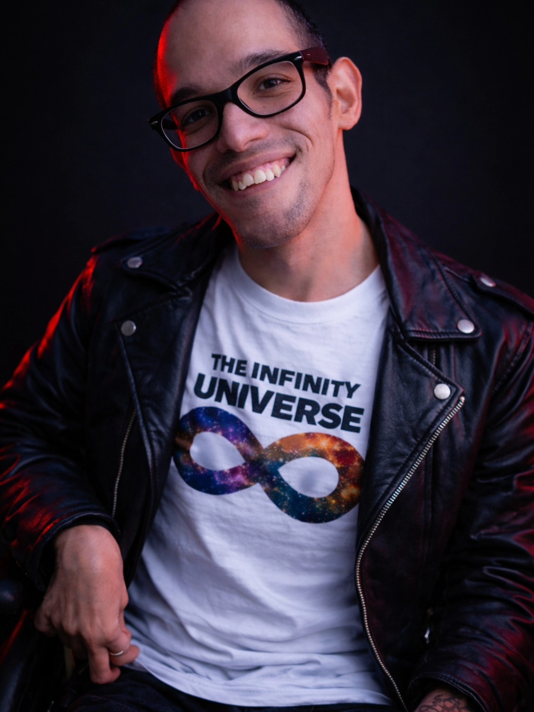

<table>
  <tr>
    <td width="32%" align="center">
      
    </td>
    <td width="68%" valign="middle">
      <h2>Qualidade não é etapa final. É cultura de entrega.</h2>
      
        
      
      
      
    </td>
  </tr>
</table>

## Sobre mim

Sou engenheiro de testes e Agile Tester, formado em Ciência da Computação, com atuação focada em qualidade de software, testes ágeis e engenharia de software.

Gosto de conectar estratégia, execução e colaboração para ajudar times a entregar produtos mais confiáveis. Meu trabalho combina pensamento crítico, aprendizado contínuo e uma visão prática sobre riscos, evidências e melhoria de processos.

## Atuação

<table>
  <tr>
    <td width="50%">
      <strong>Qualidade de software</strong> 
      Planejamento, execução e evolução de estratégias de testes para entregar valor com mais confiança.
    </td>
    <td width="50%">
      <strong>Testes ágeis</strong> 
      Integração da qualidade ao fluxo de desenvolvimento, reduzindo riscos desde as primeiras decisões.
    </td>
  </tr>
  <tr>
    <td width="50%">
      <strong>Pensamento crítico</strong> 
      Análise de cenários, questionamento de premissas e busca por evidências para decisões mais seguras.
    </td>
    <td width="50%">
      <strong>Comunidade e aprendizado</strong> 
      Compartilhamento de conhecimento sobre testes, qualidade e engenharia para fortalecer pessoas e times.
    </td>
  </tr>
</table>

## Stack

## GitHub em números

  
  
   
  

## Contribuições

## Contato

<strong>Vamos trocar ideias sobre qualidade, testes ágeis e engenharia de software.</strong>
  

  

`Qualidade não é apenas encontrar defeitos. É construir confiança.`

